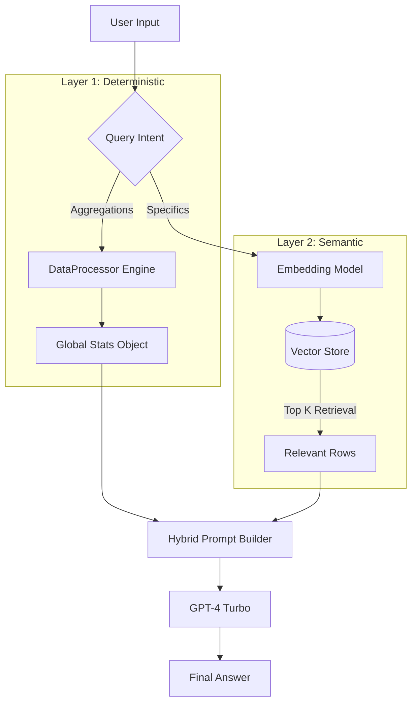

# Fund Insights Bot

**Live Demo:** [https://fund-insights-bot.vercel.app/](https://fund-insights-bot.vercel.app/)

**Built by [Vivek Kumar Yadav](https://cv.vivekmind.com)**
GitHub: [Link](https://github.com/Lnxtanx/fund-insights-bot)

---

## 🚀 Architectural Deep Dive: Hybrid RAG

This project implements a sophisticated **Hybrid Retrieval Augmented Generation (RAG)** architecture designed to solve the two biggest challenges in financial AI: **Accuracy** (handling specific numbers) and **Scalability** (handling large datasets without exorbitant costs).

### The Challenge
Standard RAG systems often fail at "Global Questions" (e.g., "What is my total P&L?"). They retrieve 10 random rows and try to sum them up, leading to wrong answers. Conversely, dumping the *entire* database into the AI context window is inaccurate for specific queries and extremely expensive.

### The Solution: Two-Layer Intelligence

This application uses a dual-layer approach to ensure 100% accuracy for both high-level stats and deep-dive specifics.

#### Layer 1: The Global Context Engine (Deterministic)
Before the AI even sees the question, a specialized TypeScript engine (`dataProcessor.ts`) scans the entire dataset in real-time.
*   **What it does**: Calculates strict mathematical aggregations: Total Holdings, Total Trades, Portfolio Market Value, and P&L.
*   **Why**: LLMs are terrible at math. We don't ask the AI to calculate P&L; we *give* it the calculated P&L as an immutable fact.

#### Layer 2: The Semantic Vector Index (Probabilistic)
For specific questions like "Why did funds X and Y drop?", we use a Vector Search Engine (`ragEngine.ts`).
1.  **Embedding**: On load, every trade and holding is converted into a 1536-dimensional vector using OpenAI's `text-embedding-3-small`.
2.  **Indexing**: These vectors are stored in an in-memory client-side vector store (optimized with IndexedDB for persistence).
3.  **Retrieval**: When a user asks a question, we compute the **Cosine Similarity** between the question's vector and our data vectors.
4.  **Rank & Filter**: The top 30 most relevant records are extracted and formatted into a concise context block.

### The Hybrid Prompt
The final prompt sent to GPT-4 is a carefully constructed hybrid:

> "Here are the **Global Stats** (Total P&L is $1.2M)...
> And here are the **30 most relevant records** for this specific question...
> Now answer the user's question."

This allows the AI to vaguely "know" everything (Global Stats) while knowing "everything" about the specific topic asked (Vector Retrieval).

---

## 🛠️ Data Pipeline Visualization

---

## 📦 Tech Stack

- **Runtime**: Node.js (v18+)
- **Frontend**: React, Vite, TypeScript
- **Styling**: Tailwind CSS, Shadcn UI
- **AI/LLM**: OpenAI GPT-4 Turbo
- **Vector Engine**: Client-side In-Memory Store (with IndexedDB caching)

---

## Author

**Vivek Kumar Yadav**  
Portfolio: [cv.vivekmind.com](https://cv.vivekmind.com)

---

© 2026 Vivek Kumar Yadav. All rights reserved.
