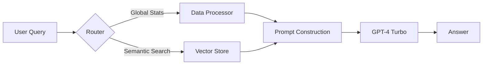

# Fund Insights Bot

A powerful, AI-driven financial analysis tool that uses **Hybrid RAG (Retrieval Augmented Generation)** to answer complex questions about your investment portfolio.

**Built by [Vivek Kumar Yadav](https://cv.vivekmind.com)**
GitHub: [Link](https://github.com/vivekmind)

---

## 🚀 How It Works

This project moves beyond simple "send everything to GPT" approaches by implementing a smart **Client-Side RAG Architecture**. This ensures scalability, reduces costs, and avoids token limits while maintaining high precision.

### The Architecture: "Hybrid RAG"

The system combines two powerful techniques to answer questions:

1.  **Global Context Layer (The "Big Picture")**
    *   **What it does**: Instantly calculates high-level statistics like Total P&L, Total Market Value, and Trade Counts directly in TypeScript (`src/lib/dataProcessor.ts`).
    *   **Why**: Standard RAG fails at "counting" (e.g., "How many trades?"). This layer ensures the AI *always* knows the overall state of the portfolio.

2.  **Vector Retrieval Layer (The "Details")**
    *   **What it does**:
        1.  **Indexing**: On page load, `src/lib/ragEngine.ts` converts every Holding and Trade record into a vector embedding using OpenAI's `text-embedding-3-small`.
        2.  **Storage**: These vectors are stored in-memory (Client Side).
        3.  **Search**: When you ask a question (e.g., "Price of Fund X"), the system performs a **Cosine Similarity Search** to find the top 30 most relevant rows.
    *   **Why**: Instead of sending 300KB of raw CSV data to the LLM (expensive & slow), we only send the ~2KB that matters.

### Data Flow Pipeline


---

## 🛠️ Tech Stack

- **Frontend**: React, Vite, TypeScript
- **Style**: Tailwind CSS, shadcn/ui
- **AI Core**:
    - **LLM**: GPT-4 Turbo (for reasoning)
    - **Embeddings**: text-embedding-3-small (for retrieval)
- **Data Engineering**: Client-side In-Memory Vector Store

---

## 📦 Getting Started

### Prerequisites
- Node.js (v18+)
- OpenAI API Key

### Installation

1. **Clone the repo**
   ```bash
   git clone <repository-url>
   cd fund-insights-bot
   ```

2. **Install Dependencies**
   ```bash
   npm install
   ```

3. **Set up Environment**
   Create a `.env` file in the root:
   ```env
   VITE_OPENAI_API_KEY=sk-your-openai-key-here
   ```

4. **Run Locally**
   ```bash
   npm run dev
   ```
   Open `http://localhost:8080`.

---

## 🧠 Why This Approach?

| Feature | Old Approach (Full Context) | New Approach (Hybrid RAG) |
| :--- | :--- | :--- |
| **Data Limit** | ~3,000 records (128k tokens) | **Unlimited** (Scales indefinitely) |
| **Cost** | ~$0.10 per query | **~$0.001 per query** (99% Cheaper) |
| **Speed** | Slow (Processing 300KB text) | **Fast** (Processing 2KB text) |
| **Accuracy** | High | **High** (Combines Precision Stats + Semantic Search) |

---

## Author

**Vivek Kumar Yadav**  
Portfolio: [cv.vivekmind.com](https://cv.vivekmind.com)

---

© 2026 Vivek Kumar Yadav. All rights reserved.
